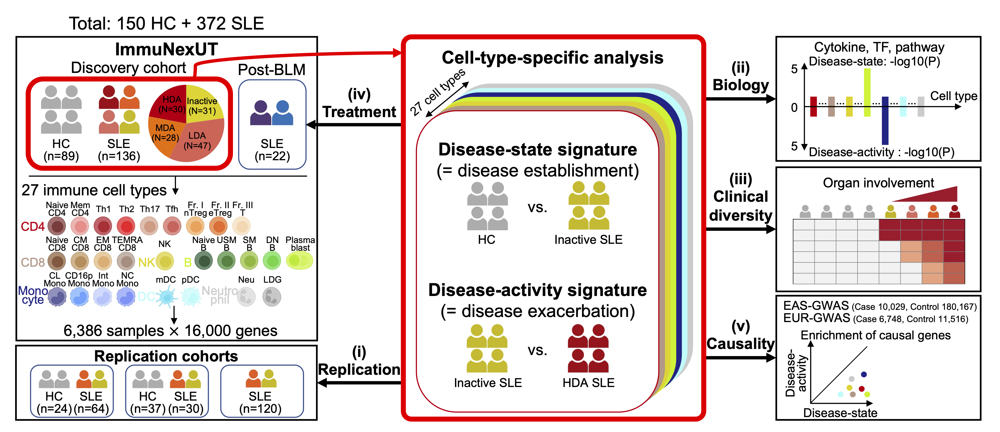

# Overview
We conducted a large-scale transcriptome study with 6,386 RNA sequencing data covering 27 immune cell types from 136 unique SLE (+ 22 post-Belimumab) and 89 healthy donors.

**Reference: Nakano M et al. Distinct transcriptome architectures underlying lupus establishment and exacerbation. Cell 2022 (doi: https://doi.org/10.1016/j.cell.2022.07.021)**

## Main findings
- We first profiled two distinct cell-type-specific transcriptomic signatures: disease-state and disease-activity signatures, reflecting disease establishment and exacerbation, respectively.

- We next identified candidate biological processes unique to each signature using multiple dataset (cytokine, transcription factor activity, pathway).

- This study suggested the clinical value of cell-type-specific disease-activity signatures, which were associated with organ involvement (e.g., mucocutaneous, musculoskeletal and renal) and responses to therapeutic agents such as belimumab.

- However, disease-activity signatures were less enriched around SLE risk variants than disease-state signatures, suggesting that the genetic studies to date may not well capture clinically vital biology in SLE.

**Figure 1. Overview of this study.**
We profiled 6,386 RNA sequencing data of 27 immune cell types from peripheral blood in HC and SLE patients (left). We identified two distinct categories of disease-relevant signatures in a cell-type-specific manner (middle), and then performed extensive downstream analyses (i-v). LDA, low diseae activity; MDA, moderate disease activity; HDA, high disease activity; BLM, belimumab; TF, transcription factor; EAS, East Asian; EUR, European.

## Data availability
All analysis results including DEG list and PC loading scores are available as supplementary data in the paper. RNA-seq data used in this study are available at the National Bioscience Database Center (NBDC) Human Database.

